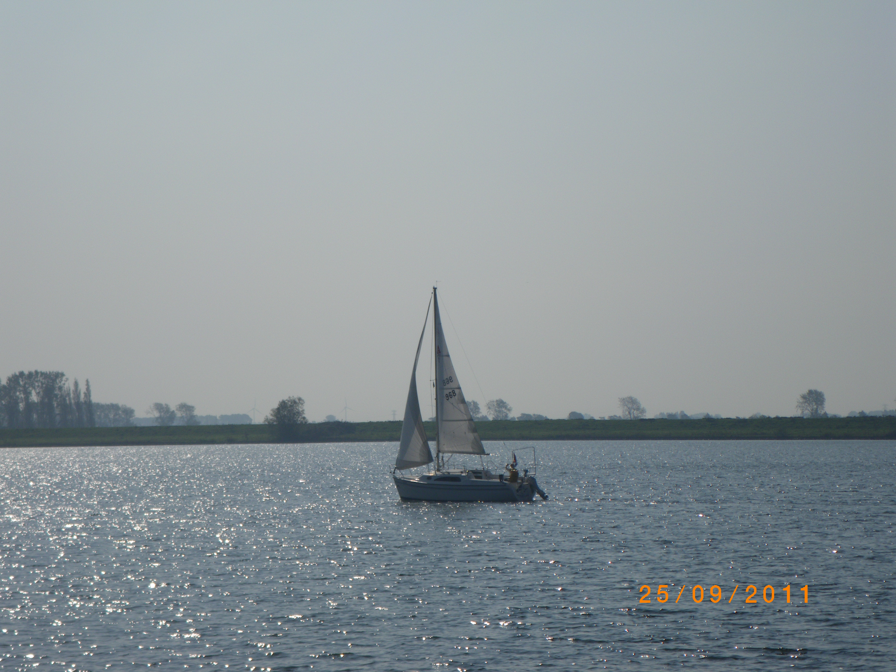
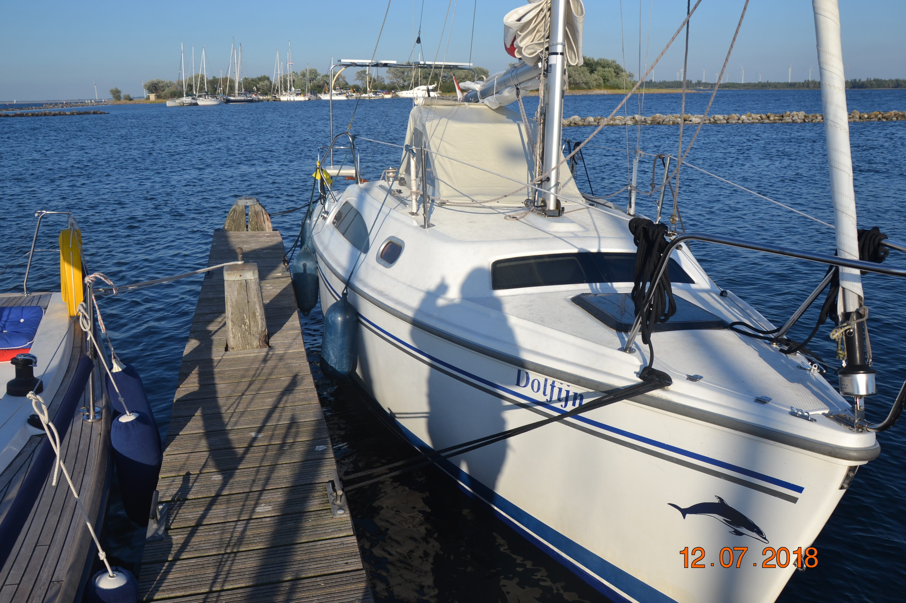
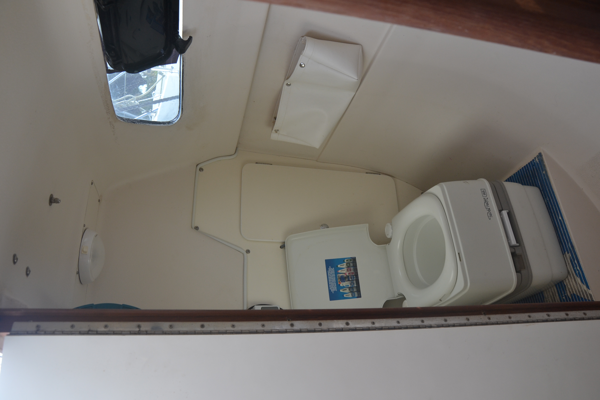
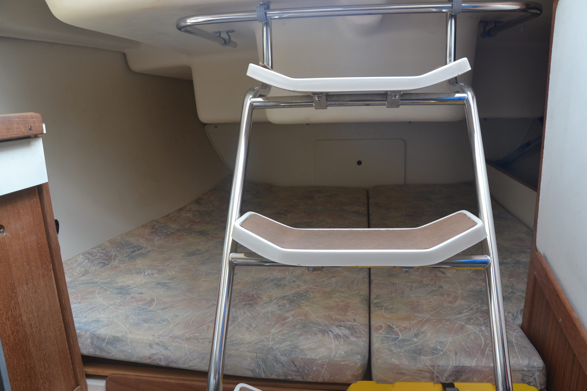
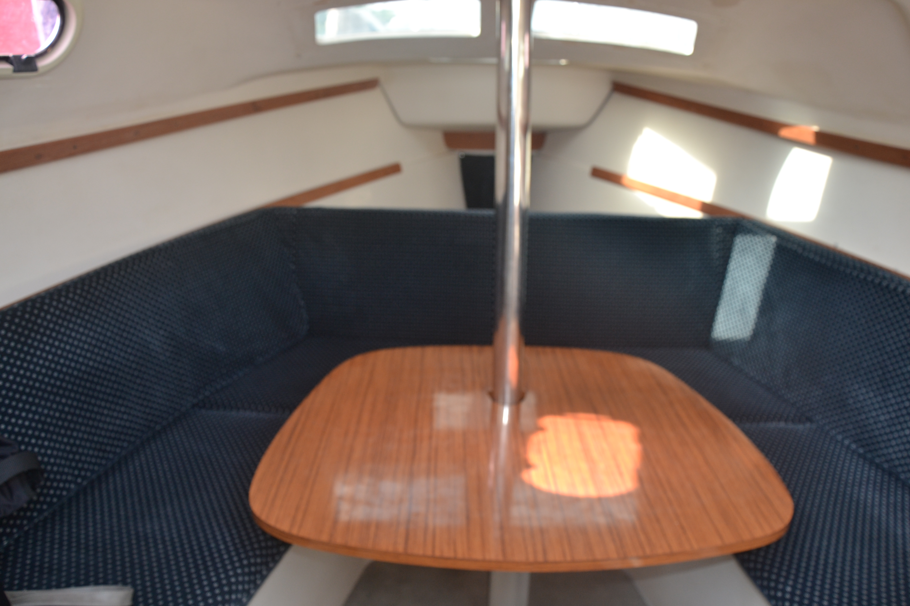
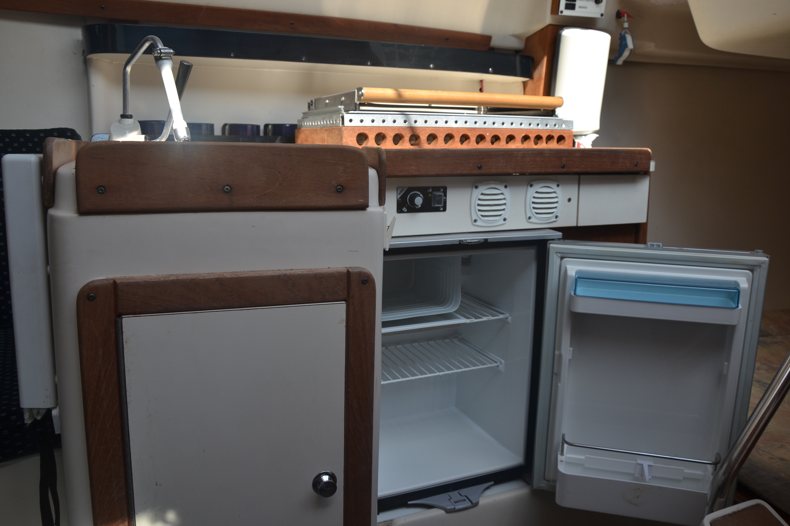
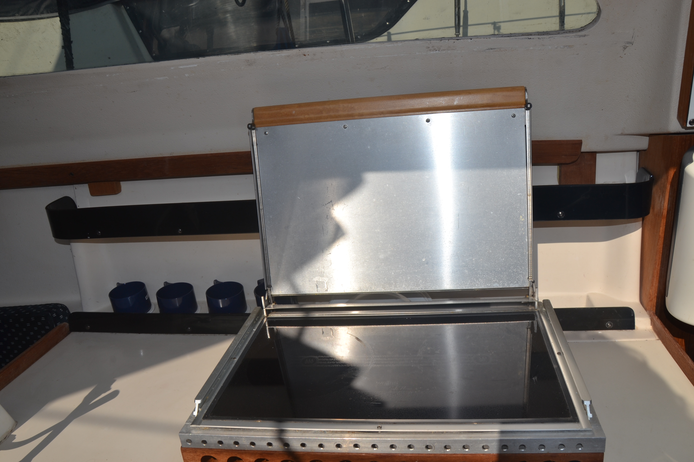
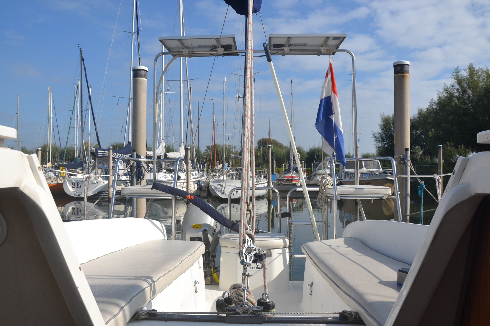

## Hoe klein toch groot kan zijn

Onze Catalina C250WK met vaste loden vleugelkiel, is een polyester toerzeilscheepje van bijna acht meter. De David onder de Goliaths.

De boot onderscheidt zich van andere boten met dezelfde lengte

## Kajuit
De boot heeft een extra groot kajuit luik met pop-up-tent.\
Daardoor is er veel ruimte en stahoogte (\>2 meter) en is de boot ook
tijdens hitte snel afgekoeld.

Er is een ruime afgesloten toilet ruimte met chemisch toilet.

 Achterin is een ruime permanente slaapplaats (twee meter lengte) en bergruimte.
 
 

In de ruime rondzit passen zes volwassenen. De rondzit heeft een stahoogte van anderhalve meter.
Met de gemakkelijk weg neembare rugleuning en tafel ontstaat er een ruime slaapplaats, geschikt voor lange mensen van twee meter. De kussens in het liggedeelte zijn vervangen door koudschuim waardoor het fijn slaapt.

In de keuken tref je een koelkast van 45 liter met klein vriesvak. Er zit een twee pits Wallas diesel kookinstallatie in. Dit kookt veiliger dan gas. Met de klep dicht kan het toestel als kachel functioneren. Alle keukengerei zoals pannen en bestek kunnen in het keukenkastje en in de besteklade. Door het grote kajuitluik is er achter het fornuis stahoogte.

## Varen
De polyester Catalina C250 Wingkeel steekt 1.10 meter en heeft daarmee
een bijna onbeperkt vaargebied.  Door de vaste loden vleugelkiel en met
de jonge high aspect rolfok kan de boot hoog aan de wind gevaren worden.
De boot is zeer wendbaar. Sturen doe je licht met het diep stekend
aangehangen roer met helmstok.

De Honda BF10 buitenboordmotor past perfect bij de boot, is gemakkelijk
bedienbaar en heeft altijd traktie door zijn extra lange staartlengte.
De Honda geeft weinig trillingen door dankzij de gedempte motorophanging. 
## Dek en kuip
Met hulp van de strijkstagen is de mast te strijken. De doorvaarhoogte is met staande mast 11 meter. Op de kajuit tref je twee
selftailing lieren. 
Met de ruime kuipbanken en hekstoelen is er plaats voor zes personen.Achter de open kuip hangt de zwemtrap.

## Uitrusting
Sinds 2018 is er een nieuwe accu geplaatst en zijn zonnepanelen
(100Watt) gemonteerd waardoor wij geen walstroom nodig hebben.

In 2016 is de Genua vervangen door een High Aspect rolfok met hoes.

De buitenboordmotor heeft in het voorjaar 2021 een grote beurt gehad.

## Onze ervaring
We hebben heerlijke zeilvakanties beleefd met ons vier koppig gezin. Drie weken lang voeren we over de Zeeuwse wateren. In het begin, toen de kinderen de lagere school leeftijd hadden, verbleven we op het Grevelingenmeer. Zeilen, ankeren, aanleggen bij de eilandjes, krabbetjes vangen.. Men verwacht niet dat je met gemak met vier personen op zo'n
kleine boot kan bivakkeren. En voor een dagje 1 of 2 gasten erbij is
goed te doen.

---

# Alle voordelen op een rijtje:

- Grote zelflozende kuip met ruimte voor zes personen
- Fijne hekstoeltjes
- Met zonnepanelen altijd een opgeladen accu
- Strijkbare mast
- Ruimtelijke beleving in de kajuit
- Door groot luik veel licht en frisse lucht
- Gezellige rondzit
- Veilig koken met Wallas, inductie kookplaten
- Afgesloten toilet
- Weinig lig kosten en onderhoudskosten Buitenboordmotor is makkelijk te
onderhouden

**Kortom:** klein maar fijn! De David onder de Goliaths!

Altijd open boot zeiler geweest maar nu behoefte aan wat meer luxe? Dan
is onze boot ideaal! Het gevoel van open boot zeilen, comfortabel
slapen, veilig kokkerellen en zonder pottenkijkers je behoefte kunnen
doen in een afgesloten toilet ruimte. De boot is met z'n tweeën goed te
bedienen. Fokkenist en stuurman. Voor solo zeilen zijn er wat
aanpassingen nodig.

Met de ondiepe Whing Keel van 1.10 meter kom je op plekken waar andere
boten vastlopen.

De meeste boten zijn op een zomerse zwoele nacht erg benauwd. Zo niet
die van ons. Er gaat een klamboe over het brede dakluik en we kunnen
heerlijk slapen!

De boot zeilt onbeladen heerlijk. Met belading voor drie weken vakantie
en vier volwassenen gaat de kruissnelheid naar beneden. Maar dat mag de
pret niet drukken als je heerlijk de Oosterschelde of het
Grevelingenmeer aan het ontdekken bent.

Interesse? Mail naar: [info@catalina250wk.nl](mailto:info@catalina250wk.nl)
